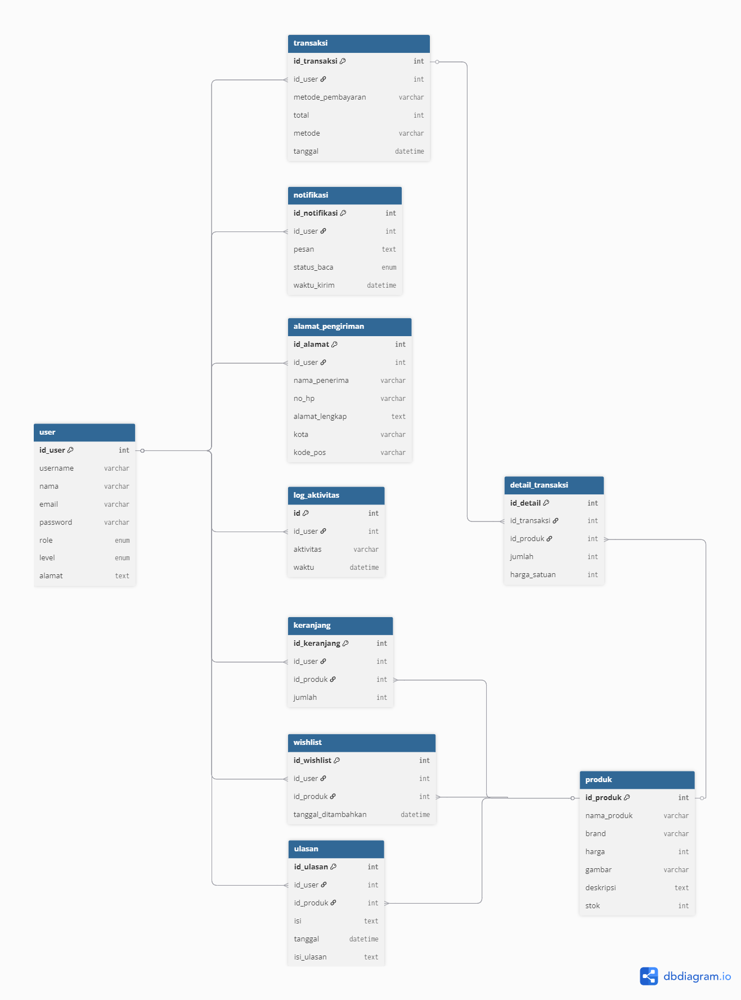
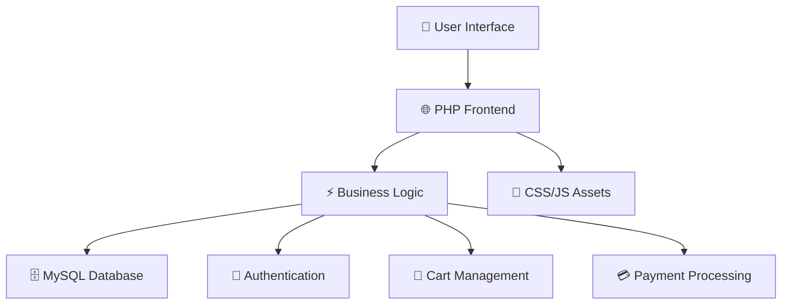

# 🌸 Nazwa Skincare Store 🌸

_A Modern E-Commerce Platform for Skincare Products_

<div align="center">


</div>

---

## 👩‍💼 About Developer

<div align="center">

|  🎯 **Information**  | 📋 **Details**                             |
| :------------------: | :----------------------------------------- |
|     👤 **Name**      | Nazwa Adinda Zhafirah                      |
|  🎓 **Student ID**   | 202312047                                  |
|     📧 **Email**     | `zhafirahnazwaadinda@gmail.com`            |
| 📚 **Study Program** | Teknik Informatika                         |
|  🏫 **Institution**  | Sekolah Tinggi Teknologi Bontang           |
|    💼 **Project**    | Nazwa Skincare Store - E-Commerce Platform |

</div>

---

## 🎬 Demo & Live Links

<div align="center">

|   🌟 **Resource**   | 🔗 **Link**                                        | 📝 **Status** |
| :-----------------: | :------------------------------------------------- | :-----------: |
| 🎥 **YouTube Demo** | `https://youtu.be/RRc3zz99uyU?si=D7J1teFQcbjl1xUs` |  ⏳ Pending   |
|  🌐 **Live Demo**   | `http://nazwa.mangaverse.my.id/auth/register.php`  |  ⏳ Pending   |

</div>

---

## 🗺️ Database Schema & ERD

<div align="center">

### 💾 Entity Relationship Diagram


_Complete database structure visualization_

</div>

---

## 📁 Project Structure

```
clone-nazwa/
├── 📂 admin/                    # Admin panel & management
│   ├── 🏠 dashboard.php        # Admin dashboard
│   ├── 👥 manajemen_user.php   # User management
│   ├── 📦 manajemen_produk.php # Product management
│   ├── 📊 monitoring.php       # System monitoring
│   ├── 📋 laporan.php          # Reports & analytics
│   └── ⚙️ pengaturan.php       # Settings configuration
├── 📂 assets/                  # Static resources
│   ├── 🎨 css/                 # Stylesheets
│   ├── 🖼️ gambar/             # Product images & media
│   └── ⚡ js/                  # JavaScript files
├── 📂 auth/                    # Authentication system
│   ├── 🔐 login.php            # User login
│   └── 📝 register.php         # User registration
├── 📂 brand/                   # Brand-specific pages
│   ├── 🌿 azarine.php          # Azarine products
│   ├── 💄 emina.php            # Emina products
│   ├── 🌸 scarlett.php         # Scarlett products
│   └── ✨ [other brands]       # Additional brand pages
├── 📂 docs/                    # Documentation
│   ├── 🗃️ erd_diagram.png      # Database ERD
│   ├── 📘 DATABASE.md          # Database documentation
│   ├── 🚀 DEPLOYMENT.md        # Deployment guide
│   ├── 📦 INSTALLATION.md      # Installation guide
│   └── 📖 USAGE.md             # Usage instructions
├── 🏠 index.php                # Homepage
├── 🛒 keranjang.php            # Shopping cart
├── 💳 checkout.php             # Checkout process
├── 📍 alamat.php               # Address management
├── 💖 wishlist.php             # Wishlist functionality
├── 📋 riwayat.php              # Transaction history
├── 🔗 koneksi.php              # Database connection
└── 🗄️ skincare.sql             # Database structure
```

---

## ✨ Key Features

<div align="center">

### 🛍️ **Customer Features**

| Feature | Description               | Status |
| :-----: | :------------------------ | :----: |
|   🔍    | Product Browsing & Search |   ✅   |
|   🛒    | Shopping Cart Management  |   ✅   |
|   💖    | Wishlist Functionality    |   ✅   |
|   💳    | Secure Checkout Process   |   ✅   |
|   📱    | Responsive Design         |   ✅   |
|   🔐    | User Authentication       |   ✅   |
|   📋    | Order History             |   ✅   |
|   ⭐    | Product Reviews           |   ✅   |

### 👨‍💼 **Admin Features**

| Feature | Description         | Status |
| :-----: | :------------------ | :----: |
|   📊    | Dashboard Analytics |   ✅   |
|   👥    | User Management     |   ✅   |
|   📦    | Product Management  |   ✅   |
|   📋    | Order Management    |   ✅   |
|   📈    | Sales Reports       |   ✅   |
|   ⚙️    | System Settings     |   ✅   |

</div>

---

## 🏗️ System Architecture

<div align="center">



</div>

---

## 📚 Documentation

Comprehensive documentation is available in the `docs/` folder:

|   📄 **Document**   | 📝 **Description**                       |                🔗 **Link**                 |
| :-----------------: | :--------------------------------------- | :----------------------------------------: |
|   🗃️ **Database**   | Complete database schema & relationships |     [📖 DATABASE.md](docs/DATABASE.md)     |
| 📦 **Installation** | Step-by-step setup instructions          | [🚀 INSTALLATION.md](docs/INSTALLATION.md) |
|  🌐 **Deployment**  | Production deployment guide              |   [☁️ DEPLOYMENT.md](docs/DEPLOYMENT.md)   |
|    📖 **Usage**     | User & admin guide                       |        [👥 USAGE.md](docs/USAGE.md)        |

---

## 🚀 Quick Start

```bash
# Clone the repository
git clone [repository-url]
cd clone-nazwa

# Setup database
mysql -u root -p < skincare.sql

# Configure database connection
# Edit koneksi.php with your database credentials

# Start local server
php -S localhost:8000
```

---

## 🛠️ Tech Stack

<div align="center">

### Backend


### Frontend


### Tools & Environment


</div>

---

## 🎨 Brand Portfolio

The platform features popular skincare brands:

<div align="center">

|   🏷️ **Brand**   | 🎯 **Focus**        | 📸 **Products** |
| :--------------: | :------------------ | :-------------: |
|  🌿 **Azarine**  | Natural Skincare    |   6 Products    |
|   💄 **Emina**   | Affordable Beauty   |   6 Products    |
|  🌱 **Garnier**  | Botanical Care      |   6 Products    |
| ✨ **Glow2Glow** | Brightening         |   10 Products   |
|  🌸 **L'Oréal**  | Luxury Care         |   6 Products    |
| 🎨 **Originote** | Color Cosmetics     |   6 Products    |
| 💖 **Scarlett**  | Premium Skincare    |   6 Products    |
| 🧴 **Skintific** | Scientific Skincare |   6 Products    |

</div>

---

## 📊 Project Statistics

<div align="center">

|     📈 **Metric**      | 📊 **Count** |
| :--------------------: | :----------: |
|    📄 **PHP Files**    |     25+      |
| 🗄️ **Database Tables** |      8+      |
|    🎨 **CSS Files**    |      2+      |
|    ⚡ **JS Files**     |      2+      |
| 🖼️ **Product Images**  |     50+      |
|     🏷️ **Brands**      |      8       |

</div>

---

## 🤝 Contributing

We welcome contributions! Here's how you can help:

1. 🍴 Fork the repository
2. 🌟 Create a feature branch
3. 💻 Make your changes
4. ✅ Test thoroughly
5. 📤 Submit a pull request

---

## 📞 Support & Contact

<div align="center">

### 💌 Get in Touch

| 🌟 **Platform** | 🔗 **Link**               | 📝 **Purpose**       |
| :-------------: | :------------------------ | :------------------- |
|  📧 **Email**   | _[your.email@domain.com]_ | General inquiries    |
| 💬 **WhatsApp** | _[+62-xxx-xxxx-xxxx]_     | Quick support        |
|  🐙 **GitHub**  | _[@username]_             | Technical issues     |
| 🌐 **LinkedIn** | _[Your LinkedIn]_         | Professional network |

</div>

---

<div align="center">

## 💝 Made with Love & Code

### 🌈 _"Beautiful skincare for beautiful people"_ 🌈

<p>
  
</p>


</div>

---

<div align="center">
  <sub>🌸 Built with passion for beautiful skincare experiences 🌸</sub>
</div>
