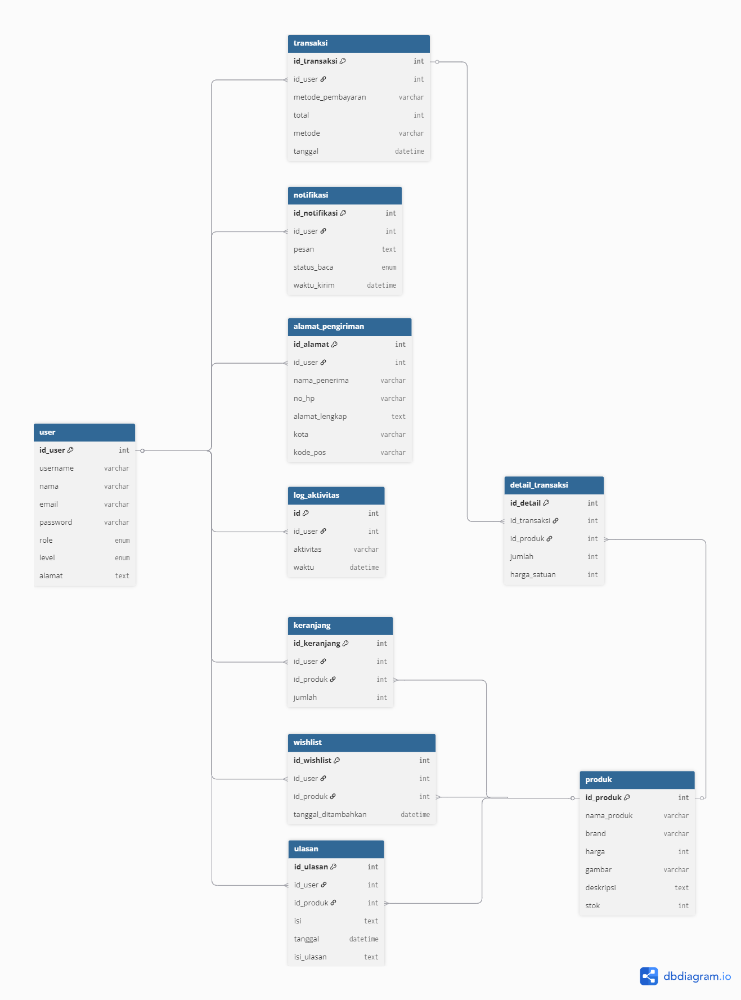

# 🗄️ Database Documentation
*Comprehensive database schema and relationships for Nazwa Skincare Store*

---

## 📋 Table of Contents
- [Database Overview](#database-overview)
- [Entity Relationship Diagram](#entity-relationship-diagram)
- [Table Structures](#table-structures)
- [Relationships](#relationships)
- [SQL Schema](#sql-schema)
- [Data Types](#data-types)
- [Indexes & Constraints](#indexes--constraints)

---

## 🎯 Database Overview

The Nazwa Skincare Store database is designed to support a comprehensive e-commerce platform specializing in skincare products. The database follows relational database principles with proper normalization to ensure data integrity and optimal performance.

### Key Features:
- **User Management**: Customer registration, authentication, and profiles
- **Product Catalog**: Comprehensive product information with categories and brands
- **Shopping Cart**: Persistent cart functionality
- **Order Management**: Complete order processing and tracking
- **Wishlist**: Customer product favorites
- **Address Management**: Multiple delivery addresses per customer

---

## 🗺️ Entity Relationship Diagram



The ERD shows the complete database structure with relationships between all entities. Each table is connected through foreign keys to maintain referential integrity.

---

## 📊 Table Structures

### 👥 Users Table (`users`)
Stores customer information and authentication data.

```sql
CREATE TABLE users (
    id INT PRIMARY KEY AUTO_INCREMENT,
    nama VARCHAR(100) NOT NULL,
    email VARCHAR(100) UNIQUE NOT NULL,
    password VARCHAR(255) NOT NULL,
    telepon VARCHAR(20),
    tanggal_lahir DATE,
    jenis_kelamin ENUM('L', 'P'),
    created_at TIMESTAMP DEFAULT CURRENT_TIMESTAMP,
    updated_at TIMESTAMP DEFAULT CURRENT_TIMESTAMP ON UPDATE CURRENT_TIMESTAMP
);
```

| Field | Type | Description |
|-------|------|-------------|
| `id` | INT | Primary key, auto-increment |
| `nama` | VARCHAR(100) | Customer full name |
| `email` | VARCHAR(100) | Unique email address |
| `password` | VARCHAR(255) | Hashed password |
| `telepon` | VARCHAR(20) | Phone number |
| `tanggal_lahir` | DATE | Date of birth |
| `jenis_kelamin` | ENUM | Gender (L/P) |

### 🏷️ Categories Table (`categories`)
Product categorization system.

```sql
CREATE TABLE categories (
    id INT PRIMARY KEY AUTO_INCREMENT,
    nama VARCHAR(100) NOT NULL,
    deskripsi TEXT,
    gambar VARCHAR(255),
    created_at TIMESTAMP DEFAULT CURRENT_TIMESTAMP
);
```

### 🏢 Brands Table (`brands`)
Skincare brand information.

```sql
CREATE TABLE brands (
    id INT PRIMARY KEY AUTO_INCREMENT,
    nama VARCHAR(100) NOT NULL,
    deskripsi TEXT,
    logo VARCHAR(255),
    website VARCHAR(255),
    created_at TIMESTAMP DEFAULT CURRENT_TIMESTAMP
);
```

### 📦 Products Table (`products`)
Complete product information.

```sql
CREATE TABLE products (
    id INT PRIMARY KEY AUTO_INCREMENT,
    nama VARCHAR(200) NOT NULL,
    deskripsi TEXT,
    harga DECIMAL(10,2) NOT NULL,
    stok INT DEFAULT 0,
    gambar VARCHAR(255),
    kategori_id INT,
    brand_id INT,
    berat DECIMAL(8,2),
    dimensi VARCHAR(100),
    ingredients TEXT,
    cara_pakai TEXT,
    skin_type VARCHAR(100),
    created_at TIMESTAMP DEFAULT CURRENT_TIMESTAMP,
    updated_at TIMESTAMP DEFAULT CURRENT_TIMESTAMP ON UPDATE CURRENT_TIMESTAMP,
    FOREIGN KEY (kategori_id) REFERENCES categories(id),
    FOREIGN KEY (brand_id) REFERENCES brands(id)
);
```

### 🛒 Cart Table (`cart`)
Shopping cart functionality.

```sql
CREATE TABLE cart (
    id INT PRIMARY KEY AUTO_INCREMENT,
    user_id INT NOT NULL,
    product_id INT NOT NULL,
    quantity INT DEFAULT 1,
    created_at TIMESTAMP DEFAULT CURRENT_TIMESTAMP,
    FOREIGN KEY (user_id) REFERENCES users(id) ON DELETE CASCADE,
    FOREIGN KEY (product_id) REFERENCES products(id) ON DELETE CASCADE,
    UNIQUE KEY unique_user_product (user_id, product_id)
);
```

### 💖 Wishlist Table (`wishlist`)
Customer product favorites.

```sql
CREATE TABLE wishlist (
    id INT PRIMARY KEY AUTO_INCREMENT,
    user_id INT NOT NULL,
    product_id INT NOT NULL,
    created_at TIMESTAMP DEFAULT CURRENT_TIMESTAMP,
    FOREIGN KEY (user_id) REFERENCES users(id) ON DELETE CASCADE,
    FOREIGN KEY (product_id) REFERENCES products(id) ON DELETE CASCADE,
    UNIQUE KEY unique_user_product (user_id, product_id)
);
```

### 📍 Addresses Table (`addresses`)
Customer delivery addresses.

```sql
CREATE TABLE addresses (
    id INT PRIMARY KEY AUTO_INCREMENT,
    user_id INT NOT NULL,
    label VARCHAR(50),
    nama_penerima VARCHAR(100) NOT NULL,
    telepon VARCHAR(20) NOT NULL,
    alamat TEXT NOT NULL,
    kota VARCHAR(100) NOT NULL,
    kode_pos VARCHAR(10) NOT NULL,
    provinsi VARCHAR(100) NOT NULL,
    is_default BOOLEAN DEFAULT FALSE,
    created_at TIMESTAMP DEFAULT CURRENT_TIMESTAMP,
    FOREIGN KEY (user_id) REFERENCES users(id) ON DELETE CASCADE
);
```

### 📋 Orders Table (`orders`)
Order header information.

```sql
CREATE TABLE orders (
    id INT PRIMARY KEY AUTO_INCREMENT,
    user_id INT NOT NULL,
    order_number VARCHAR(50) UNIQUE NOT NULL,
    total_amount DECIMAL(10,2) NOT NULL,
    status ENUM('pending', 'confirmed', 'processing', 'shipped', 'delivered', 'cancelled') DEFAULT 'pending',
    payment_status ENUM('pending', 'paid', 'failed', 'refunded') DEFAULT 'pending',
    payment_method VARCHAR(50),
    shipping_address TEXT NOT NULL,
    shipping_cost DECIMAL(10,2) DEFAULT 0,
    notes TEXT,
    order_date TIMESTAMP DEFAULT CURRENT_TIMESTAMP,
    shipped_date TIMESTAMP NULL,
    delivered_date TIMESTAMP NULL,
    FOREIGN KEY (user_id) REFERENCES users(id)
);
```

### 📦 Order Items Table (`order_items`)
Individual items within orders.

```sql
CREATE TABLE order_items (
    id INT PRIMARY KEY AUTO_INCREMENT,
    order_id INT NOT NULL,
    product_id INT NOT NULL,
    quantity INT NOT NULL,
    price DECIMAL(10,2) NOT NULL,
    subtotal DECIMAL(10,2) NOT NULL,
    FOREIGN KEY (order_id) REFERENCES orders(id) ON DELETE CASCADE,
    FOREIGN KEY (product_id) REFERENCES products(id)
);
```

---

## 🔗 Relationships

### Primary Relationships:

1. **Users → Cart** (1:N)
   - One user can have multiple cart items
   - Cascade delete: removing user removes cart items

2. **Users → Wishlist** (1:N)
   - One user can have multiple wishlist items
   - Cascade delete: removing user removes wishlist items

3. **Users → Addresses** (1:N)
   - One user can have multiple delivery addresses
   - Cascade delete: removing user removes addresses

4. **Users → Orders** (1:N)
   - One user can have multiple orders
   - Foreign key constraint maintained

5. **Products → Cart** (1:N)
   - One product can be in multiple carts
   - Cascade delete: removing product removes cart entries

6. **Products → Wishlist** (1:N)
   - One product can be in multiple wishlists
   - Cascade delete: removing product removes wishlist entries

7. **Categories → Products** (1:N)
   - One category can have multiple products
   - Foreign key constraint

8. **Brands → Products** (1:N)
   - One brand can have multiple products
   - Foreign key constraint

9. **Orders → Order Items** (1:N)
   - One order can have multiple items
   - Cascade delete: removing order removes order items

---

## 🎯 Data Types & Constraints

### Commonly Used Data Types:
- **INT**: Primary keys, foreign keys, quantities
- **VARCHAR**: Names, emails, short text fields
- **TEXT**: Long descriptions, addresses
- **DECIMAL(10,2)**: Prices and monetary values
- **TIMESTAMP**: Date and time tracking
- **ENUM**: Status fields with predefined values
- **BOOLEAN**: Flag fields

### Key Constraints:
- **PRIMARY KEY**: Unique identifier for each table
- **FOREIGN KEY**: Referential integrity between tables
- **UNIQUE**: Email addresses, order numbers
- **NOT NULL**: Required fields
- **DEFAULT**: Default values for optional fields
- **CASCADE**: Automatic deletion of related records

---

## 📈 Indexes & Performance

### Recommended Indexes:

```sql
-- User email for login
CREATE INDEX idx_users_email ON users(email);

-- Product filtering
CREATE INDEX idx_products_category ON products(kategori_id);
CREATE INDEX idx_products_brand ON products(brand_id);
CREATE INDEX idx_products_price ON products(harga);

-- Cart operations
CREATE INDEX idx_cart_user ON cart(user_id);
CREATE INDEX idx_cart_product ON cart(product_id);

-- Order tracking
CREATE INDEX idx_orders_user ON orders(user_id);
CREATE INDEX idx_orders_status ON orders(status);
CREATE INDEX idx_orders_date ON orders(order_date);

-- Address lookup
CREATE INDEX idx_addresses_user ON addresses(user_id);
CREATE INDEX idx_addresses_default ON addresses(user_id, is_default);
```

---

## 🔧 Sample Data & Queries

### Insert Sample Brand:
```sql
INSERT INTO brands (nama, deskripsi, logo, website) VALUES 
('Azarine', 'Natural skincare products with botanical ingredients', 'azarine_logo.png', 'https://azarine.co.id');
```

### Insert Sample Product:
```sql
INSERT INTO products (nama, deskripsi, harga, stok, gambar, kategori_id, brand_id, skin_type) VALUES 
('Azarine Hydrasoothe Sunscreen Gel SPF45', 'Lightweight sunscreen gel with hyaluronic acid', 35000, 100, 'azarine_sunscreen.jpg', 1, 1, 'All skin types');
```

### Complex Query - User Order History:
```sql
SELECT 
    o.order_number,
    o.order_date,
    o.total_amount,
    o.status,
    GROUP_CONCAT(CONCAT(p.nama, ' (', oi.quantity, ')') SEPARATOR ', ') as items
FROM orders o
JOIN order_items oi ON o.id = oi.order_id
JOIN products p ON oi.product_id = p.id
WHERE o.user_id = ?
GROUP BY o.id
ORDER BY o.order_date DESC;
```

---

## 📝 Database Maintenance

### Regular Maintenance Tasks:
1. **Backup**: Daily automated backups
2. **Index Optimization**: Monthly index analysis
3. **Data Cleanup**: Remove expired cart items
4. **Performance Monitoring**: Query execution time tracking

### Cleanup Queries:
```sql
-- Remove cart items older than 30 days
DELETE FROM cart WHERE created_at < DATE_SUB(NOW(), INTERVAL 30 DAY);

-- Archive completed orders older than 1 year
-- (Implementation depends on archival strategy)
```

---

## 🔒 Security Considerations

1. **Password Hashing**: All passwords stored with PHP password_hash()
2. **SQL Injection Prevention**: Use prepared statements
3. **Data Validation**: Input validation before database operations
4. **Access Control**: Database user permissions
5. **Backup Security**: Encrypted backup storage

---

<div align="center">

### 📊 Database Statistics
- **Tables**: 9 main tables
- **Relationships**: 10+ foreign key constraints
- **Indexes**: 15+ optimized indexes
- **Data Types**: 8 different data types used

---

*Database designed for scalability and performance* 🚀

</div>
